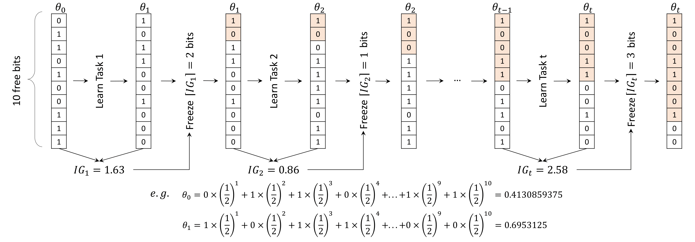
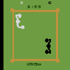
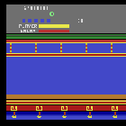
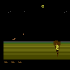

# Continual Learning via Bit-Level Information Preserving (CVPR2021) [ArXiv](https://arxiv.org/pdf/2105.04444.pdf)

This repo contains the official Implementation of the CVPR2021 paper: Continual Learning via Bit-Level Information Preserving.


### Abstract

Continual learning tackles the setting of learning different tasks sequentially. Despite the lots of previous solutions, most of them still suffer significant forgetting or expensive memory cost. In this work, targeted at these problems, we first study the continual learning process through the lens of information theory and observe that forgetting of a model stems from the loss of information gain on its parameters from the previous tasks when learning a new task. From this viewpoint, we then propose a novel continual learning approach called **B**it-**L**evel **I**nformation **P**reserving (**BLIP**) that preserves the information gain on model parameters through updating the parameters at the bit level, which can be conveniently implemented with parameter quantization. More specifically, BLIP first trains a neural network with weight quantization on the new incoming task and then estimates information gain on each parameter provided by the task data to determine the bits to be frozen to prevent forgetting. We conduct extensive experiments ranging from classification tasks to reinforcement learning tasks, and the results show that our method produces better or on par results comparing to previous state-of-the-arts. Indeed, BLIP achieves close to zero forgetting while only requiring constant memory overheads throughout continual learning


### Authors

Yujun Shi (***LV Lab***), Li Yuan (***LV Lab***), Yunpeng Chen (***YITU Technology***), Jiashi Feng (***LV Lab***)


### Graphical Illustration



We consider a simple scenario with ***one single parameter***  quantized to 10 bits to illustrate our method. $\theta_{t}$ denotes the parameter after learning on task $1$ to $t$, and $\theta_{0}$ is a randomly initialized value before training on any task. $IG_{t}$ denotes information gain on $\theta$ after learning the task $t$. Bit representation of $\theta$ after learning each task is shown below. From the higher bit positions to lower ones is more significant bits to less significant ones. Frozen bits are filled with color and the rest bits are free bits. After learning each task, the information gain is calculated and then $\lceil IG_{t} \rceil$ bits are to be frozen in the bit representation. By repeating this process, the information on previous tasks can be preserved, enabling continual learning for neural networks.


### Experiment Results

For **numerical results and ablation studies**, please check our paper.

Here, we render and compare agents trained by EWC and BLIP under different environments.

Below is visualization of sequentially learning the first 3 Atari games in our setups (i.e., kung fu master -- boxing -- james bond).

**The i-th row, j-th column GIF illustrates how well does the agent perform in the j-th task after learning the first i tasks.**

As can be seen, for EWC, the agent's performance on previous task degraded drastically after learning new tasks, while agent trained with BLIP can still perform quite well. (This phenomenon is most significant for task 1.)


***EWC***

<br/><br/><br/><br/><br/><br/>

<br/><br/><br/><br/><br/><br/>
<br/><br/><br/><br/><br/><br/>


***BLIP***

<br/><br/><br/><br/><br/><br/>

<br/><br/><br/><br/><br/><br/>
<br/><br/><br/><br/><br/><br/>


### Citation

If you find our repo/paper helpful, please consider citing our work :)
```
@article{shi2021continual,
  title={Continual Learning via Bit-Level Information Preserving},
  author={Shi, Yujun and Yuan, Li and Chen, Yunpeng and Feng, Jiashi},
  journal={arXiv preprint arXiv:2105.04444},
  year={2021}
}
```


### Prerequisites

* pytorch >= 1.3.1
* gym (*required by RL, no need if you only run image classifications*)
* baselines (*required by RL, no need if you only run image classifications*)


<br/><br/><br/>

### Image Classifications (Besides mini-ImageNet)

Under the folder of ***ImageClassification/src***:

To run BLIP with MNIST-5:

```sh
python run_blip.py --approach blip --experiment mnist5 --lr 0.01 --sbatch 64 --F-prior 1e-15 --nepochs 200
```

To run BLIP with PMNIST:

```sh
python run_blip.py --approach blip --experiment pmnist --lr 0.01 --sbatch 64 --F-prior 1e-15 --nepochs 200
```

To run BLIP with Alternating Cifar10/100:

```sh
python run_blip.py --experiment cifar --lr 0.05 --sbatch 32 --F-prior 5e-16 --mul 2
```

To run BLIP with Sequence of 5 datasets:

```sh
python run_blip.py --experiment mixture5 --lr 0.05 --sbatch 32 --F-prior 5e-17 --mul 0.8 --seed 0
```

All datasets will be automatically downloaded and processed under ***ImageClassification/data***


<br/><br/><br/>
### Image Classification (mini-ImageNet)

Under the folder ***miniImageNetClassification/src***:

The following two steps are needed to run the experiment:

* ##### Step 1: Prepare Data

First, [download](https://github.com/Yujun-Shi/BLIP/releases/download/initial/MI_raw.zip) the zipped file and extract it under the folder ***miniImageNetClassification/src/data***

Then, under ***miniImageNetClassification/src/data***, execute the following to obtain data split:

```sh
python generate_train_test_split.sh
```

After executing the file, two files named "train.pkl" and "test.pkl" will be generated. These are the data files and will be loaded for training/testing.


* ##### Step 2: run shell command

Under the folder ***miniImageNetClassification/src***:

To run BLIP with AlexNet, use:

```sh
python run_blip.py --F-prior 5e-16 --lr 0.01 --momentum 0.0 --mul 1 --sbatch 32 --seed 0 --ntasks 20 --arch alexnet
```

To run BLIP with ResNet-18, use:

```sh
python run_blip.py --F-prior 1e-16 --lr 0.01 --momentum 0.0 --mul 1.5 --sbatch 32 --seed 0 --ntasks 20 --arch resnet
```

To run Baseline methods with AlexNet, use:

```sh
python run_baselines.py --lr 0.01 --approach <baseline-method> --momentum 0.0 --mul 1 --sbatch 32 --seed 0 --ntasks 20 --arch alexnet
```

where \<baseline-method\> should be replaced by the name of baseline methods (e.g., sgd, sgd-frozen, lwf, imm-mode, ewc).


<br/><br/><br/>
### RL (sequence of 6 Atari games)

Under the folder ***RL/src***

To run our method BLIP, use:

```sh
./run_blip.sh
```

To run online EWC, use:

```sh
./run_ewc.sh
```

To run plain fine-tuning, use:

```shell
./run_ft.sh
```


<br/><br/><br/>
## Contact

Yujun Shi (shi.yujun@u.nus.edu)


## Acknowledgements

Our code is inspired by the following repo: [HAT](https://github.com/joansj/hat), [ACL](https://github.com/facebookresearch/Adversarial-Continual-Learning), [UCL](https://github.com/csm9493/UCL), [pytorch-a2c-ppo-acktr-gail](https://github.com/ikostrikov/pytorch-a2c-ppo-acktr-gail)

